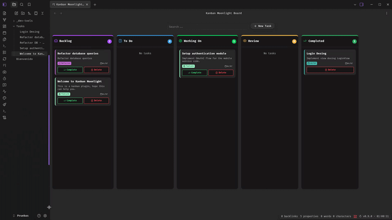

# Kanban Moonlight

[](https://buymeacoffee.com/tyliz)

A native Kanban board plugin for [Obsidian](https://obsidian.md). Transform your markdown notes into an interactive, visual Kanban board using frontmatter metadata.

## Features

- **Kanban Board View**: Renders notes tagged with a configurable tag (default `#task`) or inside a specific folder as cards in customizable columns.
- **Drag & Drop**: Move notes between columns by dragging cards — frontmatter `state` is updated automatically with a full history log.
- **Create Task**: Create new tasks directly from the Kanban board or via the command palette. A modal lets you set title, description, category, and initial column.
- **Delete Task**: Remove tasks with a single click. A confirmation dialog prevents accidental deletion. Also available as a command.
- **Search / Filter**: Real-time search across note titles, descriptions, categories, and tags with debounced input.
- **Customizable Columns**: Add, remove, reorder and rename columns. Configure each column's icon and color.
- **Categories System**: Define categories with icons and custom colors to classify notes (displayed as colored borders and tags with automatic contrast text).
- **Completion Tracking**: Mark tasks as complete with a single click. Completed notes appear in a dedicated column with a configurable time window (day/week/month/year).
- **History Log**: Every state change, creation, and completion is recorded in the note's frontmatter `history` array with timestamp and origin.
- **Auto-refresh**: The board refreshes automatically when notes are modified, created, or deleted.
- **Icon Selector**: Choose from hundreds of Lucide icons for columns and categories via a searchable suggest modal.
- **Sorting**: Notes are sorted by modification time (most recent first) within each column.
- **i18n**: English and Spanish built-in, auto-detected from Obsidian's locale.

## How it works

Notes are displayed as Kanban cards based on their frontmatter:

| Frontmatter property | Default   | Description                                                                             |
| -------------------- | --------- | --------------------------------------------------------------------------------------- |
| `tags`               | `#task`   | Tag that determines which notes appear on the board                                     |
| `state`              | `backlog` | Current column ID (`backlog`, `todo`, `workingOn`, `review`, or custom column IDs)      |
| `description`        | —         | Short description shown on the card                                                     |
| `category`           | —         | Category for color-coded borders and tags                                               |
| `history`            | —         | Auto-generated log of state changes (array of `{ state, stateId, date, from }` objects) |

> All frontmatter property names are configurable in settings.

## Installation

### From Obsidian Community Plugins (pending review)

1. Open **Settings** → **Community plugins**
2. Disable **Restricted mode** if enabled
3. Click **Browse** and search for "Kanban Moonlight"
4. Install and enable the plugin

### Manual install

1. Download the latest release from the [releases page](https://github.com/Tyliz/kanban-moonlight/releases)
2. Extract `main.js`, `manifest.json`, and `styles.css` (if present) to `<vault>/.obsidian/plugins/kanban-moonlight-plugin/`
3. Reload Obsidian and enable the plugin in **Settings** → **Community plugins**

## Usage

1. Click the Kanban icon in the left ribbon or open the board via command palette.
2. Click **+ New Task** or run the **Create New Task** command to add a task.
3. Fill in the title (required), description, category, and initial column.
4. Drag cards between columns to update their state.
5. Click **Complete** to mark a task as done, or **Delete** to remove it.
6. Use the search bar to filter cards in real time.

## Settings

| Setting                    | Description                                                                                                  |
| -------------------------- | ------------------------------------------------------------------------------------------------------------ |
| **Project Tag**            | The tag notes must have to appear on the board (default: `#task`). Works with or without `#` prefix.         |
| **Project Folder**         | Optional folder path. Notes inside will appear on the board. Created automatically if it doesn't exist.      |
| **Frontmatter Properties** | Read-only display of the configured property names for state, description, and category.                     |
| **Columns**                | Add, remove, reorder, rename columns. Change each column's icon and color.                                   |
| **Completed Column**       | Customize the completed column's icon, color, and time window (day/week/month/year).                         |
| **Categories**             | Define note categories with icons and custom colors. Categories appear as colored borders and tags on cards. |

## Commands

| Command                | Description                                            |
| ---------------------- | ------------------------------------------------------ |
| **Create New Task**    | Opens a modal to create a new kanban task.             |
| **Delete Kanban Task** | Deletes the currently open note if it's a kanban task. |

## Demos

### Demo 1 — Drag & drop and task completion


### Demo 2 — Creating tasks


### Demo 3 — Customizing the board



## Translation

Kanban Moonlight includes built-in translations for:

- English (default)
- Spanish

The language is automatically detected from your Obsidian locale settings.

## Development

```bash
# Install dependencies
npm install

# Development (watch mode)
npm run dev

# Production build
npm run build

# Lint
npm run lint
```

## Compatibility

- **Desktop**: ✅ Full support
- **Mobile**: ✅ Full support
- **Obsidian minimum version**: v1.7.2

## Support

- [Buy me a coffee](https://buymeacoffee.com/tyliz)
- [GitHub Issues](https://github.com/Tyliz/kanban-moonlight/issues)
- Email: tyliz@proton.me

## License

MIT
